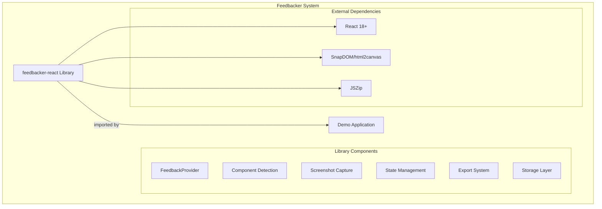
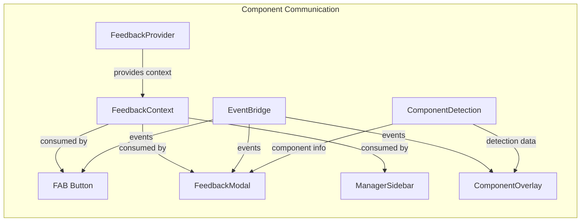
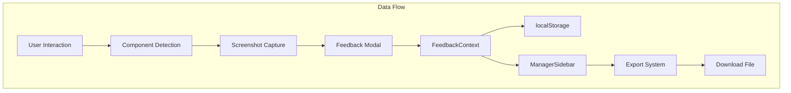

# Feedbacker Architecture

## 1. System Overview

### Architecture Style
Monorepo with Multi-Package Structure - A single repository containing a core React library and demo application, managed with npm workspaces.

### System Components


### Modules/Services Inventory
| Module/Service | Purpose | Location | Status |
|:---------------|:--------|:---------|:-------|
| feedbacker-react | Core feedback widget library | packages/feedbacker | active |
| @feedbacker/demo | Demo and testing application | packages/demo | active |
| Documentation | Architecture and spec documentation | documentation/ | active |
| CI/CD Workflows | GitHub Actions for testing and deployment | .github/workflows | active |

## 2. Modules & Services

### 2.1 Feedbacker React Library

#### Purpose
A zero-configuration React library that enables component-level feedback collection with automatic screenshots, component detection, and rich contextual data capture. Designed to be dropped into any React application with minimal setup.

#### Technology Stack
- **Language**: TypeScript 5.0+
- **Framework**: React 18+ (peer dependency)
- **Key Libraries**: JSZip (data export)
- **Build Tool**: Rollup 3.x
- **Package Manager**: npm 7+
- **CSS**: CSS Modules with PostCSS

#### Structure
```
packages/feedbacker/
├── src/
│   ├── components/         # UI Components
│   │   ├── FAB/           # Floating Action Button
│   │   ├── FeedbackModal/ # Modal for feedback collection
│   │   ├── ManagerSidebar/# Feedback management UI
│   │   └── ComponentOverlay.tsx
│   ├── context/           # React Context providers
│   ├── detection/         # Component detection system
│   │   └── strategies/    # Detection strategy implementations
│   ├── adapters/          # Screenshot capture adapters
│   ├── hooks/             # Custom React hooks
│   ├── export/            # Export functionality (MD/ZIP)
│   ├── storage/           # LocalStorage management
│   ├── utils/             # Utility functions
│   ├── types/             # TypeScript definitions
│   └── styles/            # CSS modules and variables
├── dist/                  # Build output
│   ├── index.esm.js      # ES modules build
│   ├── index.js          # CommonJS build
│   ├── index.umd.js      # UMD build
│   └── feedbacker.css    # Extracted CSS
└── rollup.config.js       # Build configuration
```

#### Key Components
- **Entry Point**: `src/index.ts` - Exports all public APIs
- **Core Provider**: `src/components/FeedbackProvider.tsx` - Main wrapper component
- **Detection System**: `src/detection/DetectionStrategy.ts` - Chain of responsibility pattern
- **State Management**: `src/context/FeedbackContext.tsx` - Global state provider
- **Event System**: `src/hooks/useFeedbackEvent.ts` - Event bus for component communication

#### Dependencies
| Dependency | Version | Purpose |
|:-----------|:--------|:--------|
| jszip | ^3.10.1 | ZIP file creation for exports |
| react | ^18.0.0 (peer) | React framework |
| react-dom | ^18.0.0 (peer) | React DOM rendering |
| @zumer/snapdom | ^1.9.0 (optional) | Fast screenshot capture |
| html2canvas | ^1.4.1 (optional) | Fallback screenshot capture |

#### Testing
- **Framework**: Jest (configured but not implemented)
- **Coverage**: 0% (tests pending implementation)
- **Test Location**: `src/__tests__/` (planned)

#### Build & Run
```bash
# Install dependencies
npm install

# Build library
npm run build

# Watch mode for development
npm run dev

# Type checking
npm run typecheck

# Linting
npm run lint
```

#### Deployment
- **Method**: npm package publication
- **Registry**: npmjs.com as `feedbacker-react`
- **Version**: Semantic versioning
- **CI/CD**: GitHub Actions for automated testing

### 2.2 Demo Application

#### Purpose
Comprehensive demonstration application showcasing all features of the Feedbacker library, including multi-framework component examples, performance comparisons, and interactive playground.

#### Technology Stack
- **Language**: TypeScript 5.0+
- **Framework**: React 18 + Vite 4
- **Key Libraries**: Prism.js (syntax highlighting)
- **Build Tool**: Vite
- **UI Examples**: Material-UI, Ant Design, Chakra UI

#### Structure
```
packages/demo/
├── src/
│   ├── App.tsx                # Main landing page
│   ├── PlaygroundV2/          # Interactive playground
│   │   ├── frameworks/        # Framework-specific demos
│   │   │   ├── mui/          # Material-UI examples
│   │   │   ├── antd/         # Ant Design examples
│   │   │   └── chakra/       # Chakra UI examples
│   │   └── FeedbackPanel.tsx # Live feedback display
│   ├── components/            # Demo components
│   └── styles.css             # Demo styles
├── dist/                      # Build output
└── vite.config.ts            # Vite configuration
```

#### Build & Run
```bash
# Install dependencies
npm install

# Run development server
npm run dev

# Build for production
npm run build

# Preview production build
npm run preview
```

## 3. Component Communication

### Internal Communication Patterns


### Event System
| Event | Source | Consumers | Purpose |
|:------|:-------|:----------|:--------|
| selection:start | FAB, API | ComponentOverlay | Initiate component selection |
| selection:end | ComponentOverlay | FeedbackModal | Complete selection, open modal |
| feedback:submit | FeedbackModal | Context, Callbacks | Save feedback |
| feedback:export | ManagerSidebar | Export System | Export data |

### State Management Flow
- **Global State**: FeedbackContext manages all feedback data
- **Local State**: Components manage their own UI state
- **Storage Sync**: Automatic sync with localStorage
- **Event Bridge**: Cross-component communication without prop drilling

## 4. Data Architecture

### Data Storage
| Storage System | Type | Purpose | Implementation |
|:---------------|:-----|:--------|:---------------|
| localStorage | Browser Storage | Persist feedback data | StorageManager class |
| React State | In-memory | Active session data | Context API |
| IndexedDB | Browser Storage | Screenshot storage (planned) | Future enhancement |

### Data Flow


### Data Models
```typescript
interface Feedback {
  id: string;
  timestamp: number;
  comment: string;
  componentInfo: ComponentInfo;
  screenshot?: string;
  browserInfo: BrowserInfo;
  htmlSnippet?: string;
}

interface ComponentInfo {
  name: string;
  path: string[];
  props?: Record<string, any>;
  position: DOMRect;
}
```

## 5. Architectural Patterns

### Chain of Responsibility - Component Detection
```
DevToolsStrategy
  ↓ (fallback)
FiberStrategy
  ↓ (fallback)
HeuristicStrategy
  ↓ (fallback)
FallbackStrategy
```

### Adapter Pattern - Screenshot Capture
```typescript
interface CaptureAdapter {
  name: string;
  isSupported(): Promise<boolean>;
  capture(element: HTMLElement, options?: CaptureOptions): Promise<CaptureResult>;
  preload?(): Promise<void>;
  cleanup?(): void;
}
```

### Provider Pattern - React Context
```
FeedbackProvider (Error Boundary)
  └── FeedbackProviderInternal (Version Check)
      └── ComponentDetectionProvider
          └── FeedbackContextProvider
              └── Application Components
```

## 6. Development Workflow

### Repository Structure
```
feedbacker/
├── packages/              # npm workspace packages
│   ├── feedbacker/       # Core library
│   └── demo/             # Demo application
├── documentation/         # Architecture and specs
├── .github/              # GitHub Actions CI/CD
├── .spec/                # Spec-driven development templates
└── node_modules/         # Dependencies
```

### Local Development
```bash
# Clone repository
git clone https://github.com/bebsworthy/feedbacker.git

# Install all dependencies
npm install

# Run library in watch mode + demo
npm run dev

# Build everything
npm run build
npm run build:demo
```

### Development Tools
- **Monorepo Management**: npm workspaces
- **Type Checking**: TypeScript strict mode
- **Linting**: ESLint with React/TypeScript rules
- **Formatting**: Prettier (configured)
- **Hot Reload**: Vite HMR for demo development

## 7. Testing Strategy

### Current State
- **Unit Tests**: Jest configured, implementation pending
- **Integration Tests**: Not implemented
- **E2E Tests**: Not implemented
- **Visual Testing**: Manual testing via demo app

### Planned Testing
```bash
# Run unit tests (future)
npm test

# Run with coverage (future)
npm run test:coverage

# Run integration tests (future)
npm run test:integration
```

## 8. Build & Deployment

### Build Pipeline
- **CI System**: GitHub Actions
- **Node Versions**: Tests on Node 16, 18, 20
- **Build Strategy**: Parallel builds for library and demo
- **Artifact Management**: npm registry for library, GitHub Pages for demo

### Library Build Outputs
| Format | File | Size (gzipped) | Use Case |
|:-------|:-----|:---------------|:---------|
| ESM | index.esm.js | ~45KB | Modern bundlers |
| CommonJS | index.js | ~45KB | Node.js/older bundlers |
| UMD | index.umd.js | ~47KB | Script tag usage |
| CSS | feedbacker.css | ~12KB | Styles |
| Types | index.d.ts | N/A | TypeScript support |

### Deployment Process
```yaml
# Automated via GitHub Actions
1. Push to main branch
2. Run tests (Node 16, 18, 20)
3. Build library and demo
4. Deploy demo to GitHub Pages
5. Manual: npm publish for releases
```

## 9. Performance Architecture

### Performance Optimizations
- **Component Detection**: Cached detection results
- **Screenshot Capture**: Pluggable adapters (SnapDOM 2x faster)
- **React Optimization**: React.memo throughout
- **Event Handling**: Debounced mouse/touch events
- **Lazy Loading**: Dynamic import for capture libraries
- **Idle Processing**: RequestIdleCallback for non-critical ops

### Bundle Size Management
- **Tree Shaking**: Full ESM support
- **Code Splitting**: Separate builds for different formats
- **Peer Dependencies**: React not bundled
- **Optional Dependencies**: Screenshot libraries loaded on demand

## 10. Security & Privacy

### Security Measures
- **No External APIs**: All processing happens client-side
- **Content Security**: HTML sanitization in feedback display
- **CORS Handling**: Proper CORS support for screenshots
- **Error Boundaries**: Graceful failure handling

### Privacy Features
- **Local Storage Only**: No data sent to external servers
- **No Analytics**: Zero tracking or telemetry
- **User Control**: Explicit export actions required
- **Data Cleanup**: Automatic storage management

## 11. Technical Debt & Roadmap

### Known Issues
| Issue | Impact | Component | Priority |
|:------|:-------|:----------|:---------|
| TypeScript warnings in build | Low | Build system | Low |
| No test coverage | Medium | All components | High |
| IndexedDB not implemented | Low | Storage | Medium |
| Component name minification in prod | Medium | Detection | Medium |

### Improvement Opportunities
- Implement comprehensive test suite
- Add IndexedDB for better screenshot storage
- Improve production build detection accuracy
- Add more capture adapter options
- Implement feedback API integration helpers

### Future Enhancements
- Server-side integration examples
- More framework adapters (Vue, Angular)
- Advanced filtering and search in manager
- Feedback analytics dashboard
- Collaboration features

## 12. Documentation

### Component Documentation
| Component | Location | Type | Status |
|:----------|:---------|:-----|:-------|
| FeedbackProvider | src/components/FeedbackProvider.tsx | JSDoc | Complete |
| Hooks | src/hooks/*.ts | JSDoc | Complete |
| Types | src/types/*.ts | TypeScript | Complete |
| Detection | src/detection/*.ts | Inline | Partial |

### System Documentation
- **Architecture**: This document
- **README**: Comprehensive usage guide
- **Configuration**: CONFIGURATION.md
- **Capture Libraries**: CAPTURE_LIBRARIES.md
- **Contributing**: CONTRIBUTING.md
- **Changelog**: CHANGELOG.md

## 13. Unique Architectural Features

### Multi-Strategy Component Detection
Sophisticated fallback chain for identifying React components:
1. **React DevTools**: Direct integration in development
2. **Fiber Inspection**: Production React tree analysis
3. **DOM Heuristics**: Pattern matching for minified builds
4. **Fallback**: Generic DOM element selection

### Pluggable Screenshot System
```typescript
// Easy adapter swapping
<FeedbackProvider captureLibrary="snapdom">
  // or
<FeedbackProvider captureAdapter={customAdapter}>
```

### Zero-Configuration Design
```tsx
// Minimal setup required
import { FeedbackProvider } from 'feedbacker-react';

function App() {
  return (
    <FeedbackProvider>
      <YourApp />
    </FeedbackProvider>
  );
}
```

### Spec-Driven Development
Mandatory workflow for feature development:
1. Architecture Analysis
2. Feature Creation
3. Research
4. Requirements
5. Design
6. Tasks
7. Implementation

---

## Metadata

**Last Updated**: 2025-08-08
**Updated By**: Architecture analysis command
**Scope**: Full system analysis

### Change Log
- 2025-08-08: Initial architecture documentation created

### Review Schedule
- **Next Review**: After major feature additions
- **Review Owner**: Development team