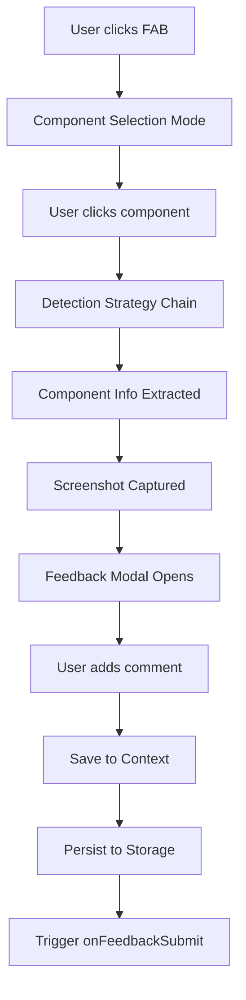
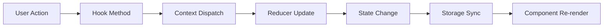

# Feedbacker Module Architecture

## 1. Module Overview

### Purpose
The feedbacker module is a self-contained React library that provides component-level feedback collection with automatic screenshots, React component detection, and rich contextual data capture. Designed as a zero-configuration drop-in solution for React applications.

### Module Boundaries
**Responsibilities:**
- React component detection in production builds
- Screenshot capture with pluggable adapters
- Feedback data collection and management
- Local storage persistence with migrations
- Export functionality (Markdown/ZIP)
- Non-intrusive UI components

**Dependencies:**
- **Internal**: None (self-contained module)
- **External**: React ecosystem, optional screenshot libraries, JSZip
- **Consumers**: Any React 18+ application

### Location
`packages/feedbacker/` - Main library module in monorepo structure

## 2. Technology Stack

### Core Technologies
- **Language**: TypeScript 5.2+ with strict mode
- **Framework**: React 18+ (peer dependency)
- **Build System**: Rollup 3.x with multi-format output
- **CSS**: CSS Modules with PostCSS processing
- **Testing**: Jest (configured)

### TypeScript Configuration
```json
{
  "compilerOptions": {
    "target": "ES2020",
    "lib": ["ES2020", "DOM", "DOM.Iterable"],
    "jsx": "react-jsx",
    "strict": true,
    "noUncheckedIndexedAccess": true,
    "exactOptionalPropertyTypes": true,
    "useUnknownInCatchVariables": true,
    "noImplicitOverride": true,
    "paths": {
      "@/*": ["./src/*"]
    }
  }
}
```

### Build Configuration
**Output Formats:**
| Format | File | Use Case | CSS Strategy |
|:-------|:-----|:---------|:-------------|
| ESM | dist/index.esm.js | Modern bundlers | Extracted to feedbacker.css |
| CommonJS | dist/index.js | Node.js/older bundlers | Injected into JS |
| UMD | dist/index.umd.js | Script tag usage | Injected into JS |

## 3. Module Structure

### Directory Organization
```
packages/feedbacker/
├── src/
│   ├── adapters/               # Screenshot capture adapters
│   │   ├── BaseAdapter.ts
│   │   ├── Html2CanvasAdapter.ts
│   │   └── SnapDOMAdapter.ts
│   ├── components/             # React UI components
│   │   ├── FeedbackProvider.tsx
│   │   ├── FeedbackModal/
│   │   │   ├── FeedbackModal.tsx
│   │   │   ├── MinimizedState.tsx
│   │   │   └── ModalPortal.tsx
│   │   ├── ManagerSidebar/
│   │   │   ├── FeedbackManager.tsx
│   │   │   ├── FeedbackList.tsx
│   │   │   ├── FeedbackCard.tsx
│   │   │   ├── ExportDialog.tsx
│   │   │   └── ConfirmDialog.tsx
│   │   ├── FAB/
│   │   │   └── FAB.tsx
│   │   └── ComponentOverlay.tsx
│   ├── context/                # React Context providers
│   │   ├── FeedbackContext.tsx
│   │   └── ComponentDetectionContext.tsx
│   ├── detection/              # Component detection system
│   │   ├── DetectionStrategy.ts
│   │   └── strategies/
│   │       ├── DevToolsStrategy.ts
│   │       ├── FiberStrategy.ts
│   │       ├── HeuristicStrategy.ts
│   │       └── FallbackStrategy.ts
│   ├── export/                 # Export functionality
│   │   ├── MarkdownExporter.ts
│   │   └── ZipExporter.ts
│   ├── hooks/                  # Custom React hooks
│   │   ├── useFeedback.ts
│   │   ├── useFeedbackStorage.ts
│   │   ├── useFeedbackEvent.ts
│   │   └── useComponentDetection.ts
│   ├── storage/                # Persistence layer
│   │   ├── StorageManager.ts
│   │   ├── LocalStorageManager.ts
│   │   └── migrations.ts
│   ├── styles/                 # CSS modules
│   │   ├── variables.css
│   │   └── [component].module.css
│   ├── types/                  # TypeScript definitions
│   │   ├── index.ts
│   │   └── capture.ts
│   ├── utils/                  # Utility functions
│   │   ├── screenshot.ts
│   │   ├── sanitize.ts
│   │   └── helpers.ts
│   └── index.ts                # Public API exports
├── dist/                       # Build output
├── rollup.config.js           # Build configuration
├── tsconfig.json              # TypeScript configuration
└── package.json               # Module metadata
```

## 4. Core Components

### Component Hierarchy
```
FeedbackProvider
├── ErrorBoundary
├── VersionCheck
└── FeedbackProviderInternal
    ├── FeedbackContextProvider
    ├── ComponentDetectionProvider
    ├── EventBridge
    ├── FAB (Floating Action Button)
    ├── ComponentOverlay
    ├── FeedbackModal
    │   ├── MinimizedState
    │   └── ModalPortal
    └── ManagerSidebar
        ├── FeedbackList
        ├── FeedbackCard
        ├── ExportDialog
        └── ConfirmDialog
```

### Key Component Responsibilities

| Component | Responsibility | Key Features |
|:----------|:---------------|:-------------|
| FeedbackProvider | Main wrapper component | Error boundary, version check, context setup |
| FeedbackModal | Feedback creation UI | Screenshot capture, comment input, component info display |
| ManagerSidebar | Feedback management | List view, filtering, export, deletion |
| ComponentOverlay | Visual selection | Hover effects, click detection, component highlighting |
| FAB | Entry point button | Minimizable, draggable, badge notifications |

## 5. Architectural Patterns

### Chain of Responsibility - Detection System
```typescript
abstract class DetectionStrategy {
  protected next?: DetectionStrategy;
  
  setNext(strategy: DetectionStrategy): DetectionStrategy {
    this.next = strategy;
    return strategy;
  }
  
  detect(element: HTMLElement): ComponentInfo | null {
    const result = this.tryDetect(element);
    if (result || !this.next) return result;
    return this.next.detect(element);
  }
  
  abstract tryDetect(element: HTMLElement): ComponentInfo | null;
}
```

**Detection Chain:**
1. `DevToolsStrategy` - React DevTools integration
2. `FiberStrategy` - React Fiber tree inspection
3. `HeuristicStrategy` - DOM pattern matching
4. `FallbackStrategy` - Generic element detection

### Adapter Pattern - Screenshot Capture
```typescript
interface CaptureAdapter {
  name: string;
  version?: string;
  isSupported(): Promise<boolean>;
  capture(element: HTMLElement, options?: CaptureOptions): Promise<CaptureResult>;
  preload?(): Promise<void>;
  cleanup?(): void;
}
```

**Implementations:**
- `Html2CanvasAdapter` - Traditional canvas-based capture
- `SnapDOMAdapter` - Modern, faster alternative
- Custom adapters supported via interface

### Provider Pattern - State Management
```typescript
// Nested context providers for separation of concerns
<FeedbackProvider>
  <FeedbackContextProvider>
    <ComponentDetectionProvider>
      {children}
    </ComponentDetectionProvider>
  </FeedbackContextProvider>
</FeedbackProvider>
```

### Singleton Pattern - Resource Management
```typescript
class CaptureManager {
  private static instance: CaptureManager;
  
  static getInstance(): CaptureManager {
    if (!CaptureManager.instance) {
      CaptureManager.instance = new CaptureManager();
    }
    return CaptureManager.instance;
  }
}
```

## 6. Module APIs

### Public Exports
```typescript
// Components
export { FeedbackProvider } from './components/FeedbackProvider';
export { FeedbackModal } from './components/FeedbackModal';
export { ManagerSidebar } from './components/ManagerSidebar';

// Hooks
export { useFeedback } from './hooks/useFeedback';
export { useFeedbackStorage } from './hooks/useFeedbackStorage';
export { useFeedbackEvent } from './hooks/useFeedbackEvent';
export { useComponentDetection } from './hooks/useComponentDetection';

// Types
export type { 
  Feedback, 
  ComponentInfo, 
  FeedbackProviderProps,
  CaptureAdapter 
} from './types';
```

### Hook APIs

#### useFeedback()
```typescript
interface UseFeedbackReturn {
  feedbacks: Feedback[];
  draft: Draft | null;
  addFeedback: (feedback: Feedback) => void;
  updateFeedback: (id: string, updates: Partial<Feedback>) => void;
  deleteFeedback: (id: string) => void;
  clearAll: () => void;
  exportFeedback: (options: ExportOptions) => Promise<void>;
  searchFeedback: (query: string) => Feedback[];
  getFeedbackById: (id: string) => Feedback | undefined;
}
```

#### useComponentDetection()
```typescript
interface UseComponentDetectionReturn {
  isSelecting: boolean;
  startSelection: () => void;
  stopSelection: () => void;
  selectedComponent: ComponentInfo | null;
}
```

### Configuration Props
```typescript
interface FeedbackProviderProps {
  position?: 'top-left' | 'top-right' | 'bottom-left' | 'bottom-right';
  primaryColor?: string;
  enabled?: boolean;
  storageKey?: string;
  autoCopy?: boolean;
  autoDownload?: boolean | 'markdown' | 'zip';
  onFeedbackSubmit?: (feedback: Feedback) => void;
  captureLibrary?: 'html2canvas' | 'snapdom' | string;
  captureAdapter?: CaptureAdapter;
  children: React.ReactNode;
}
```

## 7. Data Flow

### Feedback Creation Flow


### State Management Flow


## 8. Storage Architecture

### Storage Manager Features
- **Version Migration**: Automatic data migration between versions
- **Corruption Recovery**: Fallback to clean state on errors
- **Memory Fallback**: In-memory storage when localStorage unavailable
- **Size Management**: Automatic cleanup of old data
- **Atomic Operations**: All-or-nothing storage updates

### Data Schema
```typescript
interface StorageSchema {
  version: number;
  feedbacks: Feedback[];
  draft?: Draft;
  settings: {
    position: string;
    primaryColor: string;
    captureLibrary: string;
  };
}
```

## 9. Performance Optimizations

### Component-Level
- React.memo for all presentational components
- useMemo/useCallback for expensive operations
- Lazy loading of screenshot libraries
- Virtual scrolling for large feedback lists

### System-Level
- RequestIdleCallback for non-critical operations
- Debounced event handlers (mouse/touch)
- Efficient DOM traversal with caching
- Storage cleanup on defined thresholds

### Bundle Size
- Tree-shakeable exports
- Optional peer dependencies
- Dynamic imports for heavy features
- Minimal runtime dependencies (only JSZip)

## 10. Error Handling

### Error Boundaries
```typescript
class FeedbackErrorBoundary extends Component {
  componentDidCatch(error: Error, errorInfo: ErrorInfo) {
    console.error('[Feedbacker] Fatal error:', error);
    // Prevents feedback system from crashing host app
  }
}
```

### Graceful Degradation
- Missing screenshot library → Feedback without screenshots
- localStorage unavailable → Memory-only storage
- Component detection fails → Generic element info
- Export fails → Copy to clipboard fallback

## 11. Testing Strategy

### Test Categories
| Category | Framework | Location | Coverage |
|:---------|:----------|:---------|:---------|
| Unit Tests | Jest + RTL | src/__tests__ | Pending |
| Integration | Jest | src/__integration__ | Pending |
| E2E | Playwright | e2e/ | Planned |
| Visual | Storybook | stories/ | Planned |

### Testing Priorities
1. Detection strategy chain
2. Storage manager migrations
3. Hook behavior and state updates
4. Component rendering and interactions
5. Export functionality

## 12. Security Considerations

### Data Privacy
- No external API calls (except CDN fallbacks)
- All data stored locally
- No analytics or tracking
- User-initiated exports only

### Content Security
- HTML sanitization in feedback display
- XSS protection in component info
- CORS-aware screenshot handling
- Secure clipboard operations

## 13. Module Dependencies

### Production Dependencies
```json
{
  "dependencies": {
    "jszip": "^3.10.1"
  }
}
```

### Peer Dependencies
```json
{
  "peerDependencies": {
    "react": "^18.0.0",
    "react-dom": "^18.0.0"
  },
  "peerDependenciesMeta": {
    "html2canvas": { "optional": true },
    "@zumer/snapdom": { "optional": true }
  }
}
```

### Development Dependencies
Key dependencies for build and quality:
- Rollup ecosystem (bundling)
- TypeScript (type checking)
- PostCSS (CSS processing)
- ESLint (code quality)
- Jest (testing)

## 14. Development Workflow

### Local Development
```bash
# Install dependencies
npm install

# Development build with watch
npm run dev

# Type checking
npm run typecheck

# Linting
npm run lint

# Production build
npm run build
```

### Build Process
1. TypeScript compilation
2. Rollup bundling (3 formats)
3. CSS extraction/injection
4. Terser minification
5. Source map generation

## 15. Technical Debt & Future Improvements

### Current Limitations
| Issue | Impact | Priority |
|:------|:-------|:---------|
| No test coverage | Quality risk | High |
| TypeScript build warnings | Developer experience | Medium |
| Component name minification | Detection accuracy | Medium |
| No IndexedDB support | Storage limitations | Low |

### Planned Enhancements
- Comprehensive test suite implementation
- IndexedDB for screenshot storage
- WebWorker for heavy operations
- React Native support
- Vue/Angular adapters
- Server-side integration helpers

---

## Metadata

**Module**: feedbacker  
**Version**: 0.1.0  
**Last Updated**: 2025-08-08  
**Analysis Type**: Module-specific architecture  
**Scope**: Complete module analysis

### Change Log
- 2025-08-08: Initial module architecture documentation created