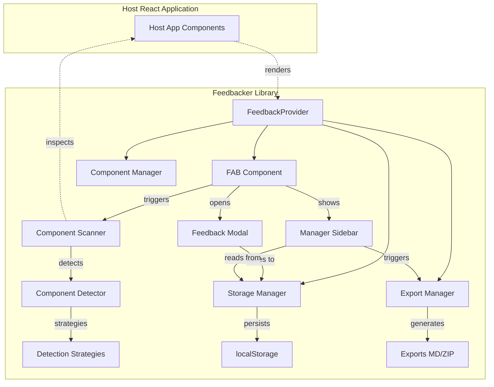
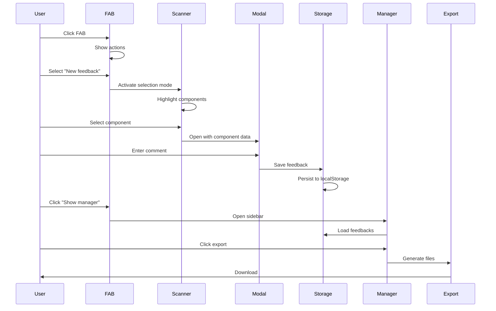

# Design Document: Core Feedbacker Implementation

## Overview
This design document outlines the technical architecture for the core feedbacker React library. The system provides a drop-in feedback collection tool that enables users to select React components and provide contextual feedback, storing data locally and offering flexible export options.

## Architecture

### System Architecture


### Component Communication Flow


## Components and Interfaces

### Core Components

#### 1. FeedbackProvider
```typescript
interface FeedbackProviderProps {
  position?: 'top-left' | 'top-right' | 'bottom-left' | 'bottom-right';
  primaryColor?: string;
  enabled?: boolean;
  storageKey?: string;
  onFeedbackSubmit?: (feedback: Feedback) => void;
}

// Usage
<FeedbackProvider position="bottom-right" primaryColor="#3b82f6" />
```

#### 2. FAB (Floating Action Button)
```typescript
interface FABState {
  expanded: boolean;
  hasDraft: boolean;
  position: { x: number; y: number };
}

interface FABAction {
  id: string;
  label: string;
  icon: ReactNode;
  onClick: () => void;
}
```

#### 3. Component Scanner
```typescript
interface ComponentScanner {
  activate(): void;
  deactivate(): void;
  onComponentSelect: (component: ComponentInfo) => void;
}

interface ComponentInfo {
  name: string;
  path: string[];  // ['App', 'Dashboard', 'Card', 'Button']
  element: HTMLElement;
  props?: Record<string, any>;
  fiber?: ReactFiber;
}
```

#### 4. Detection Strategy Chain
```typescript
abstract class DetectionStrategy {
  abstract detect(element: HTMLElement): ComponentInfo | null;
  next?: DetectionStrategy;
  
  setNext(strategy: DetectionStrategy): DetectionStrategy {
    this.next = strategy;
    return strategy;
  }
  
  handle(element: HTMLElement): ComponentInfo | null {
    const result = this.detect(element);
    if (result) return result;
    if (this.next) return this.next.handle(element);
    return null;
  }
}

class DevToolsStrategy extends DetectionStrategy { /* ... */ }
class FiberStrategy extends DetectionStrategy { /* ... */ }
class HeuristicStrategy extends DetectionStrategy { /* ... */ }
class FallbackStrategy extends DetectionStrategy { /* ... */ }
```

#### 5. Feedback Modal
```typescript
interface ModalState {
  isOpen: boolean;
  isMinimized: boolean;
  isDirty: boolean;
  component: ComponentInfo | null;
  screenshot: string | null;
  comment: string;
}

interface ModalActions {
  minimize(): void;
  restore(): void;
  submit(): void;
  cancel(): void;
}
```

#### 6. Storage Manager
```typescript
interface StorageManager {
  save(feedback: Feedback): Promise<void>;
  saveDraft(draft: Draft): Promise<void>;
  getAll(): Promise<Feedback[]>;
  getDraft(): Promise<Draft | null>;
  delete(id: string): Promise<void>;
  clear(): Promise<void>;
  getStorageInfo(): { used: number; limit: number };
}

class LocalStorageManager implements StorageManager {
  private key: string;
  private version: string;
  
  constructor(key: string = 'feedbacker') {
    this.key = key;
    this.version = '1.0';
  }
  
  // Implementation with migration support
}
```

#### 7. Export Manager
```typescript
interface ExportManager {
  exportAsMarkdown(feedbacks: Feedback[]): string;
  exportAsZip(feedbacks: Feedback[]): Promise<Blob>;
}

interface ExportOptions {
  format: 'markdown' | 'zip';
  includeImages: boolean;
  includeMetadata: boolean;
}
```

### Hook Interfaces

```typescript
// Main hook for feedback system
function useFeedback(): {
  feedbacks: Feedback[];
  draft: Draft | null;
  addFeedback: (feedback: Feedback) => void;
  deleteFeedback: (id: string) => void;
  clearAll: () => void;
  exportFeedback: (options: ExportOptions) => Promise<void>;
}

// Component detection hook
function useComponentDetection(): {
  isActive: boolean;
  activate: () => void;
  deactivate: () => void;
  selectedComponent: ComponentInfo | null;
}

// Storage synchronization hook
function useFeedbackStorage(): {
  feedbacks: Feedback[];
  isLoading: boolean;
  error: Error | null;
  refresh: () => void;
}
```

## Data Models

### Core Data Types
```typescript
interface Feedback {
  id: string;
  componentName: string;
  componentPath: string[];
  comment: string;
  screenshot?: string;  // base64 data URL
  url: string;
  timestamp: string;
  browserInfo: BrowserInfo;
  metadata?: Record<string, any>;
}

interface Draft {
  componentInfo: ComponentInfo;
  comment: string;
  screenshot?: string;
  createdAt: string;
  updatedAt: string;
}

interface BrowserInfo {
  userAgent: string;
  viewport: { width: number; height: number };
  platform: string;
}

interface FeedbackStore {
  version: string;
  feedbacks: Feedback[];
  draft?: Draft;
  settings?: UserSettings;
}

interface UserSettings {
  position?: string;
  primaryColor?: string;
  lastExport?: string;
}
```

### Validation Rules
```typescript
const validateFeedback = (feedback: Partial<Feedback>): boolean => {
  return !!(
    feedback.comment?.trim() &&
    feedback.componentName &&
    feedback.url &&
    feedback.timestamp
  );
};

const validateStorageData = (data: any): FeedbackStore | null => {
  if (!data?.version || !Array.isArray(data?.feedbacks)) {
    return null;
  }
  // Migrate if version mismatch
  return migrateIfNeeded(data);
};
```

## Error Handling

### Error Boundary
```typescript
class FeedbackErrorBoundary extends React.Component {
  componentDidCatch(error: Error, errorInfo: ErrorInfo) {
    console.error('[Feedbacker] Error caught:', error, errorInfo);
    // Disable feedback system to prevent app crash
    this.setState({ hasError: true });
  }
  
  render() {
    if (this.state.hasError) {
      return null; // Render nothing if error
    }
    return this.props.children;
  }
}
```

### Error Scenarios and Recovery
```typescript
enum ErrorType {
  STORAGE_FULL = 'STORAGE_FULL',
  STORAGE_CORRUPT = 'STORAGE_CORRUPT',
  SCREENSHOT_FAILED = 'SCREENSHOT_FAILED',
  EXPORT_FAILED = 'EXPORT_FAILED',
  DETECTION_FAILED = 'DETECTION_FAILED'
}

const errorRecovery: Record<ErrorType, () => void> = {
  [ErrorType.STORAGE_FULL]: () => {
    // Offer to export and clear old feedback
    showStorageFullWarning();
  },
  [ErrorType.STORAGE_CORRUPT]: () => {
    // Clear corrupted data and start fresh
    clearCorruptedStorage();
  },
  [ErrorType.SCREENSHOT_FAILED]: () => {
    // Continue without screenshot
    proceedWithoutScreenshot();
  },
  [ErrorType.EXPORT_FAILED]: () => {
    // Offer alternative export format
    tryAlternativeExport();
  },
  [ErrorType.DETECTION_FAILED]: () => {
    // Use fallback detection
    useFallbackDetection();
  }
};
```

## Testing Strategy

### Unit Testing
```typescript
// Component tests
describe('FAB Component', () => {
  test('renders in correct position');
  test('expands to show actions on click');
  test('shows draft indicator when draft exists');
  test('collapses on outside click');
});

// Hook tests
describe('useFeedbackStorage', () => {
  test('persists feedback to localStorage');
  test('handles storage quota exceeded');
  test('migrates old data format');
  test('recovers from corrupted data');
});

// Utility tests
describe('Component Detection', () => {
  test('detects components via DevTools hook');
  test('falls back to fiber inspection');
  test('returns Unknown Component on failure');
  test('builds correct component path');
});
```

### Integration Testing
```typescript
describe('Feedback Flow', () => {
  test('complete feedback submission flow');
  test('minimize and restore modal');
  test('export feedback as markdown');
  test('export feedback as zip');
  test('clear all feedback with confirmation');
});
```

### Performance Testing
```typescript
describe('Performance', () => {
  test('bundle size < 50KB gzipped');
  test('lazy loads html2canvas');
  test('no impact when inactive');
  test('handles 1000+ components efficiently');
});
```

### Browser Testing
- Chrome (latest)
- Firefox (latest)
- Safari (latest)
- Edge (latest)
- Mobile Safari (iOS 14+)
- Chrome Mobile (Android 10+)

## CSS Architecture

### Scoped Styles with CSS Modules
```css
/* feedbacker.module.css */
.feedbacker-root {
  --fb-primary: #3b82f6;
  --fb-text: #1f2937;
  --fb-background: #ffffff;
  --fb-border: #e5e7eb;
  --fb-shadow: 0 4px 6px rgba(0, 0, 0, 0.1);
}

.feedbacker-fab {
  position: fixed;
  z-index: 9999;
  /* Prefixed to avoid conflicts */
}

.feedbacker-modal {
  /* Scoped styles */
}

.feedbacker-sidebar {
  /* Scoped styles */
}
```

### Mobile Responsive Design
```css
@media (max-width: 768px) {
  .feedbacker-modal {
    /* Bottom sheet layout */
    position: fixed;
    bottom: 0;
    left: 0;
    right: 0;
    border-radius: 16px 16px 0 0;
  }
  
  .feedbacker-fab {
    /* Larger touch targets */
    min-width: 56px;
    min-height: 56px;
  }
}
```

## Build Configuration

### Rollup Configuration
```javascript
export default {
  input: 'src/index.ts',
  output: [
    {
      file: 'dist/index.js',
      format: 'cjs'
    },
    {
      file: 'dist/index.esm.js',
      format: 'esm'
    },
    {
      file: 'dist/index.umd.js',
      format: 'umd',
      name: 'Feedbacker'
    }
  ],
  external: ['react', 'react-dom'],
  plugins: [
    typescript(),
    postcss({ modules: true }),
    terser()
  ]
};
```

### Package Entry Points
```json
{
  "main": "dist/index.js",
  "module": "dist/index.esm.js",
  "types": "dist/index.d.ts",
  "exports": {
    ".": {
      "import": "./dist/index.esm.js",
      "require": "./dist/index.js"
    },
    "./styles": "./dist/feedbacker.css"
  }
}
```

Does the design look good? If so, we can move on to the implementation plan.